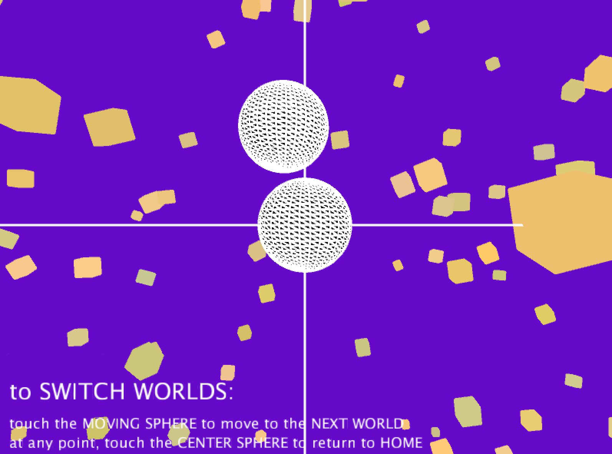

# 3D Music Visualizations

##Project Description:
In Java, I programmed a 3D interactive experience in which the graphics correspond to classical piano (which I recorded a friend playing) in the background. The user uses the arrow keys, as well as the 'a' and 'z' keys to navigate. By touching the moving sphere, the user switches through 4 different 'worlds.' To go back home, the user touches the center sphere.

[Home](index.md)

### Screenshots of each world:

 

This [link](https://github.com/kyrakraft/3d-music-visualizations) will take you to a page where you can download and check out the full project!
