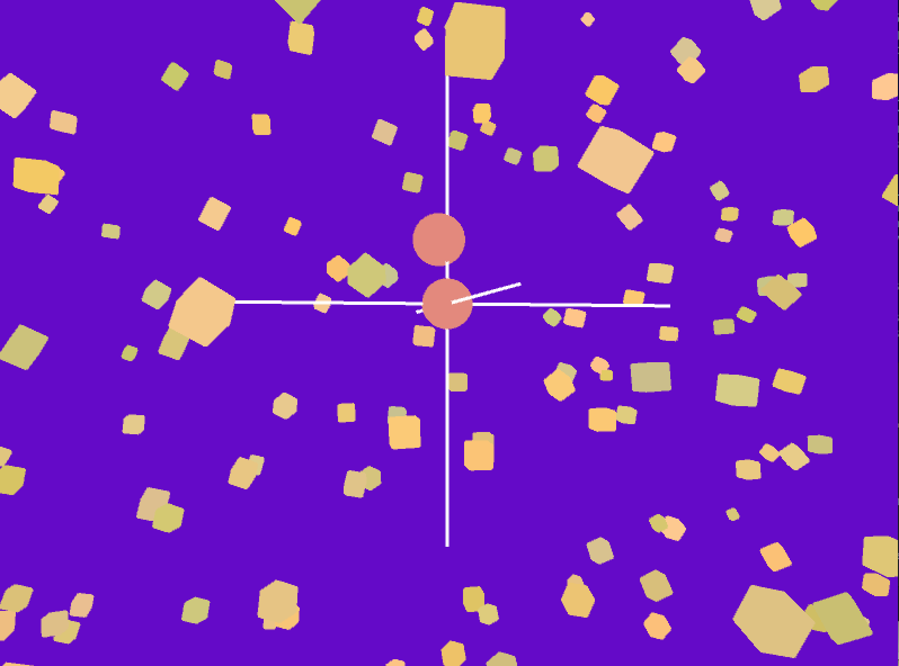

[Home](index.md)

# 3D Music Visualizations
 

## Project Description:
I programmed this 3D interactive experience in Java. The graphics correspond to classical piano, which I recorded a friend playing, in the background. The user uses the keyboard to navigate and can move through - as well as switch between - 4 different 'worlds,' each containing a different classical piece.

### Screenshots of each world:

  

This [link](https://github.com/kyrakraft/3d-music-visualizations) will take you to a page where you can download the full project.
