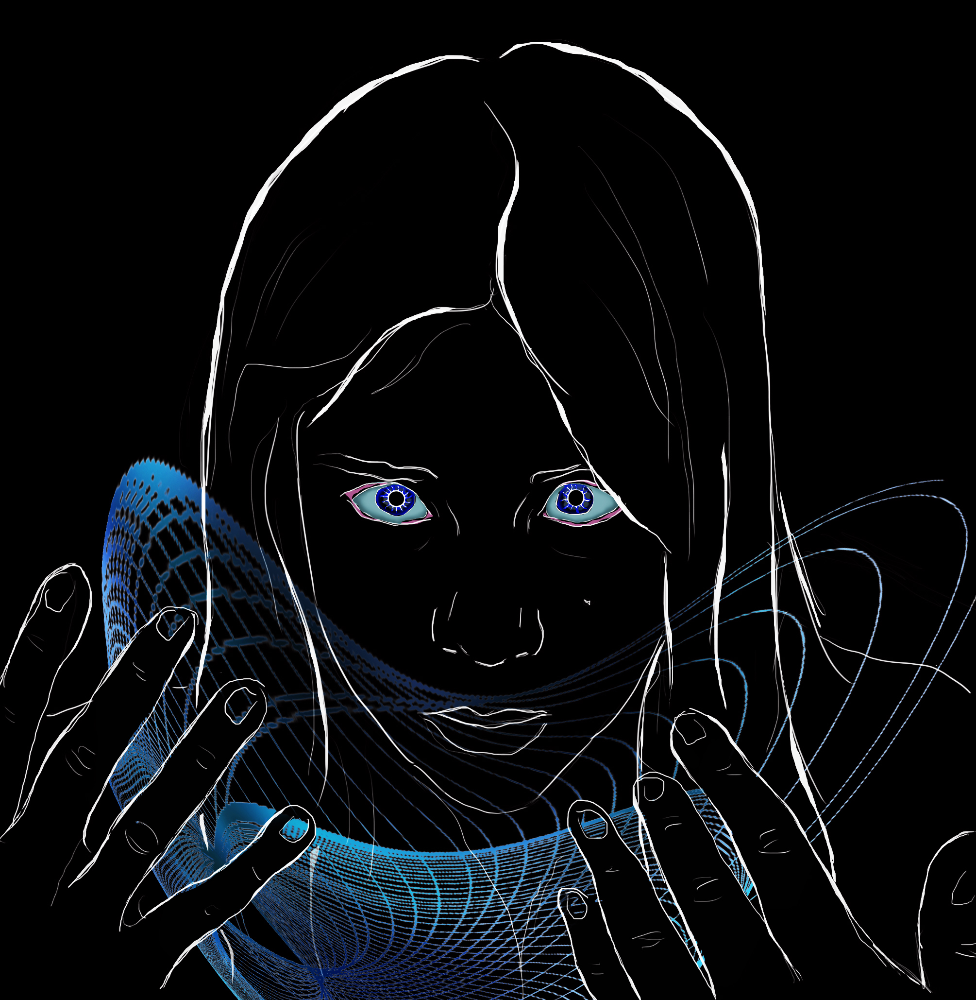
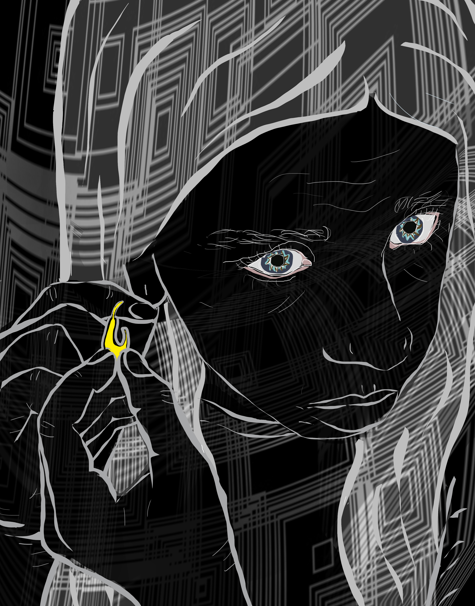

# Art

[Home](index.md)

These pieces are a combination of hand-drawn sketches, Processing programs, a Wacom tablet, and Photoshop.

### "Morning" series:
     

     

### Additional pieces:

  
  
  
  
  
  
  
