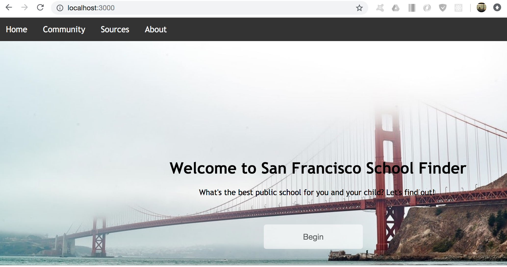

# Art & Programming Projects
## created by Kyra Kraft

<!-- ## examples of past projects

* generative design combined with hand-drawn art
* 3d interactive experience with sound and visuals
* sites designed with html, css, and javascript that incorporate databases
* mobile apps designed through React -->

### Art with Generative Design
#### Main language used: Processing

  
Click [here](artpage.md) to view all art.  

### 3D Interactive Music Visualizations
#### Main language used: Java

  
Click [here](3dmusic.md) for project details.  

### San Francisco Public School Finder Web Application
#### Main language used: Javascript

  
Click [here](sfschools.md) for project details.
